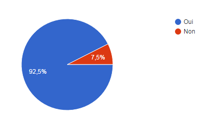
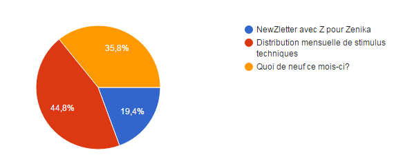
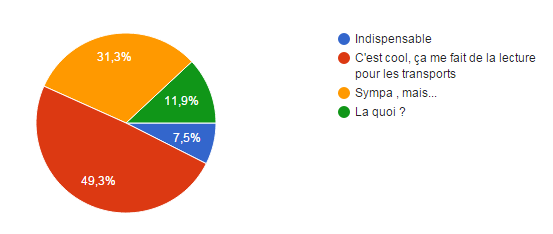
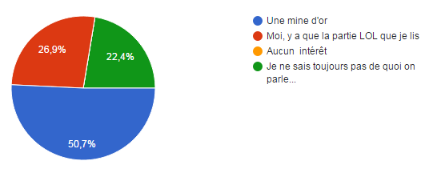
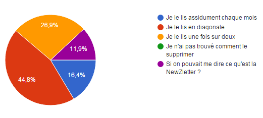
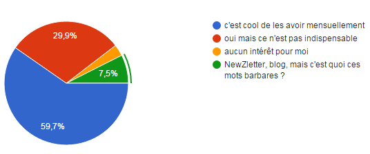
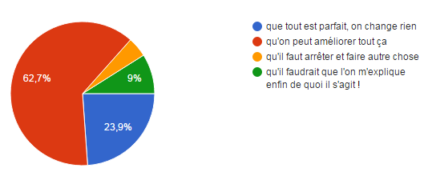
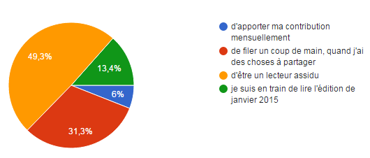
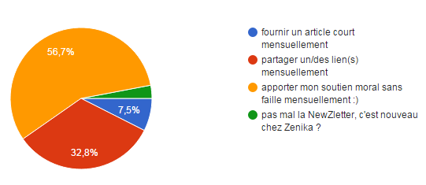

#NewZLetter 
#####Février 2016
---

*Distribution mensuelle de stimulus techniques* 

## Résultat du sondage
### Synthèse des réponses et les conséquences :)

Première chose, je vous renouvelle mes remerciements pour votre participation.  Ce feedback va permettre d'améliorer le contenu et l'organisation de la newZletter (enfin j'espère :)).

Je vais vous présenter les différentes réponses à l'aide de graphique en y apportant (lorsque c'est nécessaire un petit commentaire).

Commençons par la première question : 
###Connais-tu la NewZletter Zenika ?

*Bon les réponses apportées sont plutôt rassurantes :). La majorité des personnes ayant répondues connaissent la NewZletter, ouf :)*

###Sans reprendre une édition, pourrais-tu identifier le slogan de la NewZletter ?

*J'ai compris, il faut l'afficher plus gros :)*

###La NewZletter dans ton quotidien

Retour plutôt positif, si on fait le cumul des réponses en bleu et en rouge, on obtient une majorité. C'est encourageant! 
La réponse en orange, montre qu'il y a des choses à faire évoluer et c'est positif également.

###Le contenu de la NewZletter

*Le score en bleu est sans appel! cool. Et ce qui est intéressant c'est qu'il n'y a vraisemblablement rien à jeter (score en orange).*

###L'article chapeau

*L'article chapeau semble intéresser d'une manière générale, mais je note qu'il faudrait trouver des sujets plus attrayant.  Si vous avez des idées et/ou l'inspiration, n'hésitez pas à m'écrire :)*

###Les stats du blog

*D'après les résultats à cette question, les stats du blog intéresse une majorité et ne dérange pas les autres (score en rouge)*

###Par rapport à la NewZletter, je pense

*Cette question est particulièrement intéressante et les réponses apportées m'amène à penser qu'il y a des choses à faire pour rendre la lecture plus bleue encore.*
***Si vous avez des idées, des propositions.. et là je m'adresse au 62.7% des Zenikas en rouge.. n'hésitez pas à faire des propositions (elles ne sont pas engageante, je vous rassure ;) ).***

###Moi, j'ai envie

*Cette question épineuse indique que des contributeurs en herbe sont motivés pour apporter leur pierre à l'édifice :) et moi je suis content, car plus on est de fou plus on rit ^^*
***Je vais envoyer un mail aux personnes ayant répondu en rouge ou orange afin de voir comment on peut s'organiser.***

###En terme de contribution, je pourrai

*Cette question est dans la même veine que la précédente*

La dernière question sous forme de champ libre a remonté les points suivants : 

* Très joli et pas long à lire, à conserver tel quel.
Pour les fonctions support c'est utile?
* En faire une vidéo :)
* Utile, mais je ne suis pas un fan du format mail surtout
* Concernant le contenu, je trouve qu'il s'appauvrit (message pour la DT et les tribus ;) ), et au niveau des stats du blog, il serait pas mal d'avoir une analyse en plus
* Les questions sont un peu soit à 1000% positive soit à 0,5% dès le deuxième choix ... Un peu biaisé et je ne sais pas si tu auras des réponses précises de cette manière ;-)
* RSS forever
* Je mettrai bien les stats de blog avec l'infographie de Sock Ying
* Concernant le contenu, je trouve qu'il s'appauvrit (message pour la DT et les tribus ;) )
* Il faut sauver le soldat NewZletter ! Motivé pour apporter mon aide de temps en temps ;) 

*Remarque*
*Il semble que certaine personne n'ait pas connaissance de cette newZletter (selon les réponses apportées à certaines questions. J'imagine que certaine personne est pu répondre par dépit ou alors par amusement. Néanmoins, il se peut que certain est répondu sincèrement à ces questions, car ils n'ont jamais reçu la lettre mensuelle. si c'est le cas n'hésitez pas à vous manifester. Les anciennes éditions se trouvent sur le github Zenika à cette [adresse](https://github.com/Zenika/newzletter).*

##Revue de presse

 * [*Projet Natick - Microsoft*](http://goo.gl/WGyHR8) - Palmes et tuba de rigueur 
 * [*Be Lazy With Java 8*](https://goo.gl/fnmZEy) - Cool Lazy tranquille
 * [*Pourquoi choisir Backbone en 2015 ?*](http://www.infoq.com/fr/presentations/bow-florent-duveau?utm_campaign=infoq_content&utm_source=infoq&utm_medium=feed&utm_term=global) - Pourquoi pas?
 * [*Oracle envisage de passer à un Web sans plugin*](http://goo.gl/mMjpYn) - Plugin c'est has been
 * [*Shapeless : not a tutorial part 1*](http://goo.gl/KqZgVq) - Côté obscure de Scala
 * [*Le Modèle Mémoire révisé d'OpenJDK*](http://goo.gl/K2JKWu) - Update memory
 * [*Customisation de son terminal*](http://goo.gl/zPla63) - Hmmmm!
 * [*Why Should Java Value Types Be Immutable?*](https://goo.gl/rYNd8x). - oui pourquoi?

 
##Conférences

 * [*Kubecon 2016*](https://ti.to/kubecon/kubecon-eu-2016) - Londre 10-11 mars 2016

##Challenges

 * [*# Hash Code*](https://goo.gl/aOHnxP) - Oneline 11 février 2016
  
 
---

##Les stats du Blog
#####Janvier 2016 (top 15)

Titre de page |	Pages vues	| Consultations uniques
--------------|-------------|--------------------

**HTTP 404** - *Stats not found this month! :-/*

##LoL

 * [Les joies de l'infomatique](http://goo.gl/b8ZaQN) - déjà vu
 *  [Ces petites joies de notre métier ](http://goo.gl/vtPL0c) - yeah!
 
